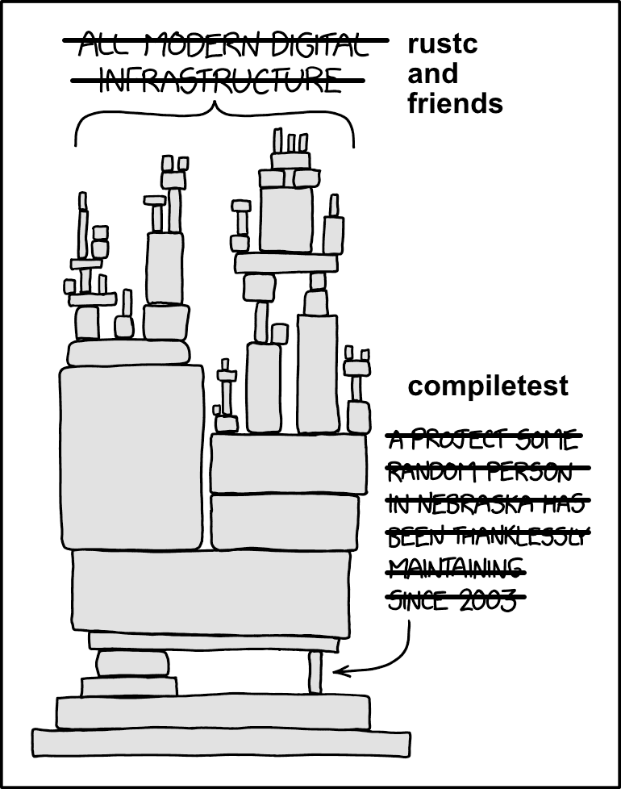

# Preface

This little book records my adventure in reworking [`compiletest`]. 

## Context

[`compiletest`] is the main test harness of the Rust compiler (see the [Compiletest chapter] in
the dev-guide). Over the years, it has seen many additions and modifications that is mostly
organically grown, which makes it a pain to debug and maintain.

[compiler-team MCP 536][mcp-536] was accepted to rewrite compiletest out of tree as [`ui_test`].
But there's still tons of work to be done, and there isn't a clear picture of how to completely
replace [`compiletest`] with [`ui_test`] -- even the MVP goal of using [`ui_test`] to run the
["ui" test suite][ui-test-suite] is highly non-trivial.

I expect the rewrite to take multiple years. In the meantime, [`rustc`] and friends still need to
rely on [`compiletest`] to have some guardrails for making changes and minimizing regressions. We
better make sure the test harness is reliable, otherwise the compiler and friends are like a big
jenga tower that will collapse if you pull out the "compiletest" piece.

  

  Image edited from <https://xkcd.com/2347/>

[`compiletest`]: https://github.com/rust-lang/rust/tree/master/src/tools/compiletest
[Compiletest chapter]: https://rustc-dev-guide.rust-lang.org/tests/compiletest.html
[mcp-536]: https://github.com/rust-lang/compiler-team/issues/536
[`ui_test`]: https://github.com/oli-obk/ui_test
[ui-test-suite]: https://github.com/rust-lang/rust/tree/master/tests/ui
[`rustc`]: https://github.com/rust-lang/rust
